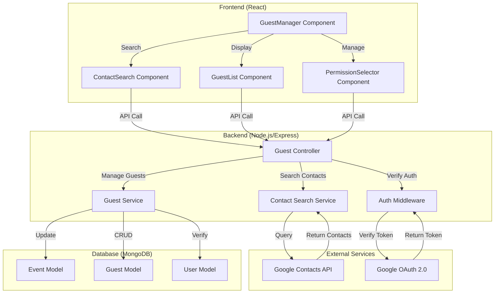
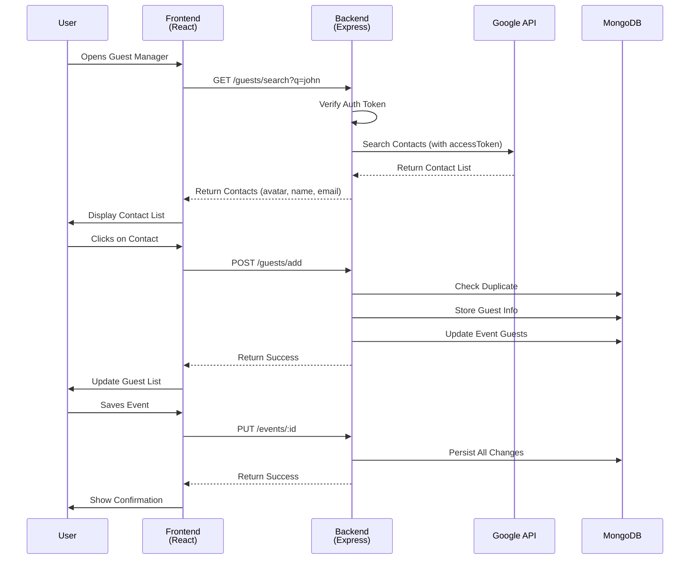

# Design Document: Add Guest with Google Contacts Avatar

## Overview

This design document describes the implementation of a guest management system that integrates Google Contacts API to enhance the user experience when adding guests to calendar events. Instead of manually entering email addresses, users can now search their Google Contacts, view profile pictures, names, and email addresses, and add them as guests with specific permissions.

The system consists of three main layers:

- **Frontend**: React components for contact search, display, and guest management
- **Backend**: Node.js/Express services for Google Contacts API integration and data persistence
- **Database**: MongoDB schema for storing guest information and event associations

### Key Features

- Real-time contact search with debouncing
- Display contact avatars, names, and emails
- Add/remove guests with permission management
- Duplicate prevention
- Email validation and normalization
- Persistent storage of guest information
- Error handling and recovery

---

## Architecture

### System Architecture Diagram



### Data Flow Diagram



---

## Components and Interfaces

### Frontend Components

#### 1. GuestManager Component (Container)

**Purpose**: Main container component that orchestrates guest management functionality.

**Props**:

```typescript
interface GuestManagerProps {
  eventId: string;
  onGuestAdded?: (guest: Guest) => void;
  onGuestRemoved?: (guestId: string) => void;
  readOnly?: boolean;
}
```

**State**:

```typescript
interface GuestManagerState {
  guests: Guest[];
  searchResults: Contact[];
  searchTerm: string;
  isLoading: boolean;
  error: string | null;
  selectedGuest: Guest | null;
}
```

**Responsibilities**:

- Manage overall guest management state
- Coordinate between search and guest list components
- Handle guest addition/removal
- Manage permissions

---

#### 2. ContactSearch Component

**Purpose**: Handles contact search input and displays search results.

**Props**:

```typescript
interface ContactSearchProps {
  onSearch: (term: string) => Promise<Contact[]>;
  onSelectContact: (contact: Contact) => void;
  isLoading?: boolean;
  error?: string | null;
  existingGuests?: Guest[];
}
```

**Features**:

- Debounced search input (300ms)
- Real-time search results display
- Duplicate prevention (gray out already-added contacts)
- Pagination for 50+ results
- Error display with retry option

**Rendering Logic**:

```typescript
interface ContactItemProps {
  contact: Contact;
  isSelected?: boolean;
  isDuplicate?: boolean;
  onSelect: (contact: Contact) => void;
}

// Each contact displays:
// - Avatar (or placeholder if missing)
// - Name (or email if name missing)
// - Email address
// - Selection indicator
```

---

#### 3. GuestList Component

**Purpose**: Displays all added guests with their information and actions.

**Props**:

```typescript
interface GuestListProps {
  guests: Guest[];
  onRemoveGuest: (guestId: string) => void;
  onUpdatePermission: (guestId: string, permission: Permission) => void;
  readOnly?: boolean;
}
```

**Features**:

- Display guest avatar, name, email
- Show assigned permissions
- Hover actions (edit, remove)
- Empty state message

---

#### 4. PermissionSelector Component

**Purpose**: Allows users to assign and modify guest permissions.

**Props**:

```typescript
interface PermissionSelectorProps {
  guestId: string;
  currentPermission: Permission;
  onPermissionChange: (permission: Permission) => void;
  availablePermissions?: Permission[];
}
```

**Supported Permissions**:

```typescript
type Permission = "edit_event" | "view_guest_list" | "invite_others";

const PERMISSION_LABELS = {
  edit_event: "Edit event",
  view_guest_list: "View guest list",
  invite_others: "Invite others",
};
```

---

### Backend API Endpoints

#### 1. Search Contacts

```
GET /api/guests/search?q=<search_term>&limit=50&offset=0

Request Headers:
  Authorization: Bearer <access_token>

Response (200 OK):
{
  "success": true,
  "data": {
    "contacts": [
      {
        "id": "google_contact_id",
        "email": "john.doe@example.com",
        "name": "John Doe",
        "avatar": "https://lh3.googleusercontent.com/...",
        "phoneNumbers": ["123-456-7890"]
      }
    ],
    "total": 150,
    "limit": 50,
    "offset": 0
  }
}

Response (400 Bad Request):
{
  "success": false,
  "error": "Invalid search term"
}

Response (401 Unauthorized):
{
  "success": false,
  "error": "Google authentication required"
}

Response (500 Internal Server Error):
{
  "success": false,
  "error": "Failed to search contacts: <details>"
}
```

#### 2. Add Guest to Event

```
POST /api/guests/add

Request Body:
{
  "eventId": "event_id",
  "email": "john.doe@example.com",
  "name": "John Doe",
  "avatar": "https://lh3.googleusercontent.com/...",
  "permission": "view_guest_list"
}

Response (201 Created):
{
  "success": true,
  "data": {
    "guestId": "guest_id",
    "eventId": "event_id",
    "email": "john.doe@example.com",
    "name": "John Doe",
    "avatar": "https://lh3.googleusercontent.com/...",
    "permission": "view_guest_list",
    "createdAt": "2024-01-15T10:30:00Z"
  }
}

Response (400 Bad Request):
{
  "success": false,
  "error": "Invalid email format"
}

Response (409 Conflict):
{
  "success": false,
  "error": "Guest already added to this event"
}
```

#### 3. Remove Guest from Event

```
DELETE /api/guests/:guestId

Response (200 OK):
{
  "success": true,
  "message": "Guest removed successfully"
}

Response (404 Not Found):
{
  "success": false,
  "error": "Guest not found"
}
```

#### 4. Update Guest Permission

```
PUT /api/guests/:guestId/permission

Request Body:
{
  "permission": "edit_event"
}

Response (200 OK):
{
  "success": true,
  "data": {
    "guestId": "guest_id",
    "permission": "edit_event",
    "updatedAt": "2024-01-15T10:35:00Z"
  }
}
```

#### 5. Get Event Guests

```
GET /api/events/:eventId/guests

Response (200 OK):
{
  "success": true,
  "data": {
    "guests": [
      {
        "guestId": "guest_id",
        "email": "john.doe@example.com",
        "name": "John Doe",
        "avatar": "https://lh3.googleusercontent.com/...",
        "permission": "view_guest_list",
        "addedAt": "2024-01-15T10:30:00Z"
      }
    ]
  }
}
```

---

## Data Models

### Database Schema

#### Guest Model

```typescript
interface Guest {
  _id: ObjectId;
  eventId: ObjectId; // Reference to Event
  userId: ObjectId; // Reference to User (event owner)
  email: string; // Normalized to lowercase
  name: string;
  avatar?: string; // URL to avatar image
  permission: Permission; // 'edit_event' | 'view_guest_list' | 'invite_others'
  googleContactId?: string; // Reference to Google Contact
  status: "pending" | "accepted" | "declined"; // Future: RSVP status
  createdAt: Date;
  updatedAt: Date;
}

// MongoDB Schema
const guestSchema = new Schema({
  eventId: {
    type: Schema.Types.ObjectId,
    ref: "Task",
    required: true,
    index: true,
  },
  userId: {
    type: Schema.Types.ObjectId,
    ref: "User",
    required: true,
    index: true,
  },
  email: { type: String, required: true, lowercase: true, trim: true },
  name: { type: String, required: true },
  avatar: { type: String },
  permission: {
    type: String,
    enum: ["edit_event", "view_guest_list", "invite_others"],
    default: "view_guest_list",
  },
  googleContactId: { type: String },
  status: {
    type: String,
    enum: ["pending", "accepted", "declined"],
    default: "pending",
  },
  createdAt: { type: Date, default: Date.now },
  updatedAt: { type: Date, default: Date.now },
});

// Compound index for duplicate prevention
guestSchema.index({ eventId: 1, email: 1 }, { unique: true });
guestSchema.index({ userId: 1, eventId: 1 });
```

#### Updated Event/Task Model

```typescript
// Add to existing Task model:
{
  guests: [
    {
      guestId: ObjectId,      // Reference to Guest
      email: string,
      name: string,
      avatar?: string,
      permission: Permission,
      status: 'pending' | 'accepted' | 'declined'
    }
  ]
}

// Or keep guests as array of emails (current implementation)
// and use separate Guest collection for detailed info
```

#### Contact Model (Frontend/API Response)

```typescript
interface Contact {
  id: string; // Google Contact ID
  email: string;
  name: string;
  avatar?: string; // URL to profile picture
  phoneNumbers?: string[];
  addresses?: string[];
  organizations?: string[];
}
```

---

## Correctness Properties

_A property is a characteristic or behavior that should hold true across all valid executions of a system—essentially, a formal statement about what the system should do. Properties serve as the bridge between human-readable specifications and machine-verifiable correctness guarantees._

### Property 1: Contact Display Completeness

_For any_ contact in search results, the rendered contact item SHALL display the contact's avatar (or placeholder if missing), name (or email if name missing), and email address.

**Validates: Requirements 2.1, 2.2, 2.3, 2.4, 2.5**

### Property 2: Guest Addition Idempotence

_For any_ guest added to an event, attempting to add the same guest again SHALL result in a duplicate prevention error and the guest list SHALL remain unchanged.

**Validates: Requirements 3.5**

### Property 3: Guest Removal Round-Trip

_For any_ guest added to an event and then removed, the contact SHALL become available again in the search results and the guest list SHALL no longer contain that guest.

**Validates: Requirements 5.1, 5.3**

### Property 4: Guest Persistence Round-Trip

_For any_ guest added to an event with email, name, and avatar, saving the event and then loading it SHALL return the same guest information (email, name, avatar, permission).

**Validates: Requirements 3.4, 6.1, 6.2, 4.4, 4.5**

### Property 5: Email Validation and Normalization

_For any_ email address provided, if it is in valid format, it SHALL be normalized to lowercase; if it is invalid, the system SHALL reject it with an error message.

**Validates: Requirements 9.1, 9.2, 9.3**

### Property 6: Permission Update Persistence

_For any_ guest with an assigned permission, updating the permission and saving the event SHALL persist the new permission; loading the event SHALL return the updated permission.

**Validates: Requirements 4.2, 4.4, 4.5**

### Property 7: Search Result Rendering

_For any_ list of contacts returned from Google Contacts API, the Guest_Manager SHALL render all contacts in the list with their information displayed correctly.

**Validates: Requirements 1.3, 2.1, 2.2, 2.3**

### Property 8: Debounce Effectiveness

_For any_ rapid sequence of search input changes within 300ms, the Contact_Search_Service SHALL make only one API call to Google Contacts API.

**Validates: Requirements 8.3**

### Property 9: Pagination Handling

_For any_ search result with more than 50 contacts, the Guest_Manager SHALL implement pagination or lazy loading to display results in manageable chunks.

**Validates: Requirements 8.4**

### Property 10: Error Handling Consistency

_For any_ API error (Google Contacts API failure, database failure, authentication failure), the system SHALL return an error response with a descriptive message to the user.

**Validates: Requirements 1.5, 6.5, 7.5**

### Property 11: Guest List Display Completeness

_For any_ guest in the guest list, the Guest_Manager SHALL display the guest's avatar, name, email, and assigned permission.

**Validates: Requirements 10.2**

### Property 12: Token Refresh Automation

_For any_ expired Google authentication token, the Contact_Search_Service SHALL automatically refresh the token and retry the API call without user intervention.

**Validates: Requirements 7.4**

---

## Error Handling

### Error Categories and Responses

#### 1. Authentication Errors

```typescript
// Missing or invalid Google authentication
{
  code: 'AUTH_REQUIRED',
  message: 'Google authentication required',
  statusCode: 401,
  action: 'Redirect to Google OAuth login'
}

// Token expired
{
  code: 'TOKEN_EXPIRED',
  message: 'Authentication token expired',
  statusCode: 401,
  action: 'Automatically refresh token and retry'
}

// Token refresh failed
{
  code: 'TOKEN_REFRESH_FAILED',
  message: 'Failed to refresh authentication token',
  statusCode: 401,
  action: 'Prompt user to re-authenticate'
}
```

#### 2. Validation Errors

```typescript
// Invalid email format
{
  code: 'INVALID_EMAIL',
  message: 'Email address is not in valid format',
  statusCode: 400,
  details: { email: 'invalid.email' }
}

// Invalid search term
{
  code: 'INVALID_SEARCH_TERM',
  message: 'Search term must be at least 1 character',
  statusCode: 400
}

// Missing required field
{
  code: 'MISSING_FIELD',
  message: 'Required field missing: name',
  statusCode: 400
}
```

#### 3. Conflict Errors

```typescript
// Duplicate guest
{
  code: 'DUPLICATE_GUEST',
  message: 'Guest already added to this event',
  statusCode: 409,
  details: { email: 'john.doe@example.com' }
}
```

#### 4. External API Errors

```typescript
// Google Contacts API failure
{
  code: 'GOOGLE_API_ERROR',
  message: 'Failed to search contacts: Service temporarily unavailable',
  statusCode: 503,
  action: 'Retry with exponential backoff'
}

// Google API rate limit
{
  code: 'RATE_LIMIT_EXCEEDED',
  message: 'Too many requests to Google API',
  statusCode: 429,
  retryAfter: 60
}
```

#### 5. Database Errors

```typescript
// Database connection failure
{
  code: 'DB_CONNECTION_ERROR',
  message: 'Database connection failed',
  statusCode: 500,
  action: 'Retry operation'
}

// Database operation failure
{
  code: 'DB_OPERATION_ERROR',
  message: 'Failed to save guest information',
  statusCode: 500,
  details: { operation: 'insert', collection: 'guests' }
}
```

#### 6. Not Found Errors

```typescript
// Guest not found
{
  code: 'GUEST_NOT_FOUND',
  message: 'Guest not found',
  statusCode: 404,
  details: { guestId: 'invalid_id' }
}

// Event not found
{
  code: 'EVENT_NOT_FOUND',
  message: 'Event not found',
  statusCode: 404
}
```

### Error Recovery Strategies

1. **Automatic Retry**: For transient errors (network timeouts, rate limits), implement exponential backoff
2. **User Notification**: Display user-friendly error messages in the UI
3. **Fallback Options**: Provide alternative actions (e.g., manual email entry if search fails)
4. **Logging**: Log all errors for debugging and monitoring
5. **Graceful Degradation**: Allow partial functionality if some features fail

---

## Testing Strategy

### Unit Tests

#### Frontend Components

- **ContactSearch Component**:
  - Renders search input field
  - Debounces search requests
  - Displays search results correctly
  - Shows placeholder for missing avatars/names
  - Prevents selection of duplicate guests
  - Handles empty search results

- **GuestList Component**:
  - Renders all guests with complete information
  - Displays permission selectors
  - Shows hover actions (edit, remove)
  - Handles empty guest list

- **PermissionSelector Component**:
  - Displays all available permissions
  - Updates permission on selection
  - Persists permission changes

#### Backend Services

- **Contact Search Service**:
  - Validates search terms
  - Calls Google Contacts API with correct parameters
  - Handles API errors gracefully
  - Implements token refresh logic
  - Paginates results correctly

- **Guest Service**:
  - Validates email format and normalizes to lowercase
  - Prevents duplicate guest addition
  - Stores guest information correctly
  - Updates guest permissions
  - Removes guests from database
  - Retrieves guests for an event

- **Email Validation**:
  - Accepts valid email formats
  - Rejects invalid email formats
  - Normalizes emails to lowercase

### Integration Tests

- **End-to-End Guest Addition**:
  - Search for contact
  - Select contact
  - Add as guest
  - Verify guest appears in list
  - Verify guest stored in database

- **Guest Removal**:
  - Remove guest from list
  - Verify guest deleted from database
  - Verify contact available again in search

- **Permission Management**:
  - Add guest with default permission
  - Update guest permission
  - Save event
  - Load event
  - Verify permission persisted

- **Google Contacts API Integration**:
  - Authenticate with Google
  - Search contacts
  - Handle API errors
  - Refresh expired tokens

### Property-Based Tests

**Property 1: Contact Display Completeness**

- Generate random contacts with varying avatar/name presence
- Verify all contacts render with required information
- Verify placeholders display when data missing

**Property 2: Guest Addition Idempotence**

- Generate random guests
- Add guest to event
- Attempt to add same guest again
- Verify duplicate prevention error
- Verify guest list unchanged

**Property 3: Guest Removal Round-Trip**

- Generate random guests
- Add guests to event
- Remove each guest
- Verify guest removed from list
- Verify contact available in search again

**Property 4: Guest Persistence Round-Trip**

- Generate random guests with email, name, avatar
- Add guests to event
- Save event
- Load event
- Verify all guest information matches original

**Property 5: Email Validation and Normalization**

- Generate random email addresses (valid and invalid)
- Validate each email
- Verify valid emails normalized to lowercase
- Verify invalid emails rejected with error

**Property 6: Permission Update Persistence**

- Generate random guests with random permissions
- Update each guest's permission
- Save event
- Load event
- Verify permissions match updated values

**Property 7: Search Result Rendering**

- Generate random contact lists (0-100+ contacts)
- Render contact list
- Verify all contacts displayed correctly
- Verify no contacts missing or duplicated

**Property 8: Debounce Effectiveness**

- Generate rapid sequence of search inputs
- Verify only one API call made within 300ms window
- Verify final search term used for API call

**Property 9: Pagination Handling**

- Generate search results with 50+ contacts
- Verify pagination implemented
- Verify all contacts accessible through pagination

**Property 10: Error Handling Consistency**

- Mock various API errors
- Verify error responses contain descriptive messages
- Verify error handling doesn't crash application

**Property 11: Guest List Display Completeness**

- Generate random guests with all information
- Display guest list
- Verify all guest information displayed
- Verify no information missing

**Property 12: Token Refresh Automation**

- Mock expired token scenario
- Verify token refresh called automatically
- Verify API call retried after refresh
- Verify no user intervention required

### Test Configuration

- **Minimum iterations per property test**: 100
- **Test framework**: Jest (existing in project)
- **Property testing library**: fast-check (for JavaScript)
- **Mocking**: Jest mocks for Google API, database, authentication
- **Coverage target**: 80%+ for critical paths

---

## Implementation Considerations

### Frontend Stack

- **Framework**: React (assumed from context)
- **State Management**: Redux (mentioned in requirements)
- **HTTP Client**: Axios (already in dependencies)
- **UI Library**: Material-UI or similar (for components)

### Backend Stack

- **Framework**: Express.js (already in use)
- **Database**: MongoDB with Mongoose (already in use)
- **Authentication**: Passport.js with Google OAuth 2.0 (already configured)
- **API Documentation**: Swagger/OpenAPI (already in use)

### Performance Considerations

- Debounce search requests (300ms)
- Implement pagination for 50+ results
- Cache Google Contacts API responses (with TTL)
- Use database indexes for fast queries
- Lazy load guest avatars

### Security Considerations

- Validate all email inputs
- Sanitize user inputs to prevent injection
- Use HTTPS for all API calls
- Store Google access tokens securely (already in Redis)
- Implement rate limiting for API endpoints
- Verify user ownership of event before modifying guests

### Scalability Considerations

- Use database indexes for efficient queries
- Implement caching for frequently accessed data
- Consider pagination for large guest lists
- Monitor Google API rate limits
- Implement queue system for bulk operations (future)

---

## Dependencies and Integration Points

### External Dependencies

- **Google Contacts API**: For searching and retrieving contacts
- **Google OAuth 2.0**: For user authentication
- **MongoDB**: For persistent storage
- **Redis**: For token caching (already in use)

### Internal Dependencies

- **Auth Module**: For Google authentication and token management
- **Task Module**: For event/task management
- **User Module**: For user information

### Configuration Requirements

- Google OAuth credentials (already configured)
- MongoDB connection string (already configured)
- Redis connection (already configured)
- API rate limiting configuration
- Token refresh configuration

---

## Future Enhancements

1. **RSVP Management**: Track guest acceptance/decline status
2. **Guest Notifications**: Send email invitations to guests
3. **Bulk Guest Import**: Import multiple guests at once
4. **Guest Groups**: Create and manage guest groups
5. **Calendar Integration**: Sync with Google Calendar
6. **Guest History**: Track guest additions/removals over time
7. **Advanced Permissions**: More granular permission levels
8. **Guest Comments**: Allow guests to add comments to events
9. **Conflict Detection**: Detect scheduling conflicts for guests
10. **Analytics**: Track guest engagement and attendance
