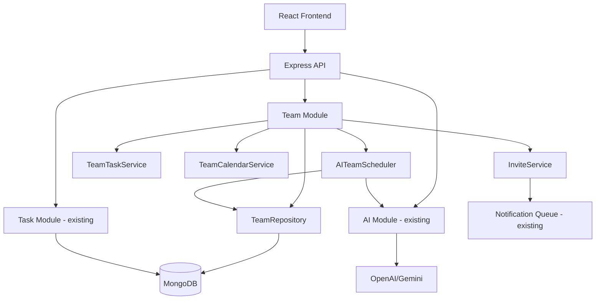
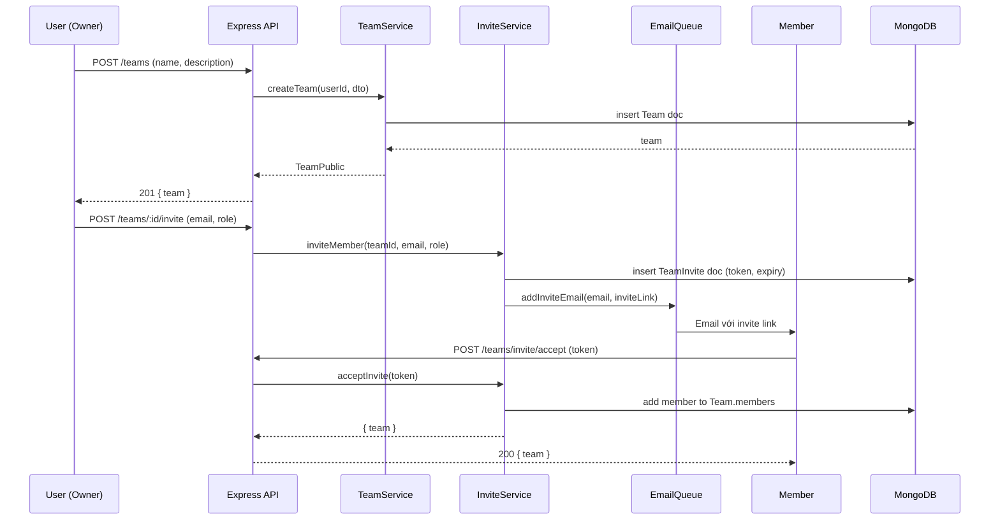
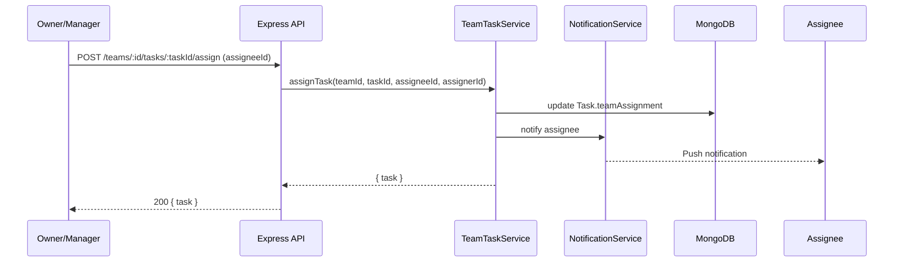
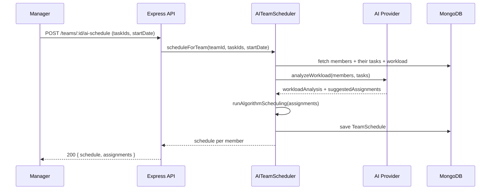

# Design Document: Team Management (Jira-style)

## Overview

Tính năng Team Management cho phép người dùng tạo và quản lý nhóm làm việc theo phong cách Jira: tạo team, mời thành viên qua email, phân công task cho từng member, xem team calendar với AI detect conflict, và AI tự động phân bổ task dựa trên workload thực tế của từng người.

Tính năng tích hợp sâu với hệ thống Task hiện có (Task model, AI scheduling) và mở rộng thêm lớp "team context" lên trên cơ sở hạ tầng cá nhân đã có.

## Architecture



## Sequence Diagrams

### Tạo Team & Mời Thành Viên



### Phân Công Task cho Member



### AI Team Scheduling



## Components and Interfaces

### Component 1: TeamService

**Purpose**: CRUD cho Team entity, quản lý membership

**Interface**:

```typescript
interface ITeamService {
  createTeam(userId: string, dto: CreateTeamDto): Promise<TeamPublic>;
  getTeam(teamId: string, userId: string): Promise<TeamPublic>;
  updateTeam(
    teamId: string,
    userId: string,
    dto: UpdateTeamDto,
  ): Promise<TeamPublic>;
  deleteTeam(teamId: string, userId: string): Promise<void>;
  listTeams(userId: string): Promise<TeamPublic[]>;
  removeMember(
    teamId: string,
    ownerId: string,
    memberId: string,
  ): Promise<TeamPublic>;
  updateMemberRole(
    teamId: string,
    ownerId: string,
    memberId: string,
    role: TeamRole,
  ): Promise<TeamPublic>;
}
```

**Responsibilities**:

- Tạo/sửa/xóa team
- Kiểm tra quyền (chỉ owner/admin mới được sửa)
- Quản lý danh sách members

### Component 2: InviteService

**Purpose**: Xử lý luồng mời thành viên qua email

**Interface**:

```typescript
interface IInviteService {
  inviteMember(
    teamId: string,
    inviterId: string,
    email: string,
    role: TeamRole,
  ): Promise<void>;
  acceptInvite(token: string, userId: string): Promise<TeamPublic>;
  declineInvite(token: string): Promise<void>;
  revokeInvite(
    teamId: string,
    ownerId: string,
    inviteId: string,
  ): Promise<void>;
  listPendingInvites(
    teamId: string,
    userId: string,
  ): Promise<TeamInvitePublic[]>;
}
```

**Responsibilities**:

- Tạo invite token (UUID, expire 7 ngày)
- Gửi email qua NotificationQueue hiện có
- Xử lý accept/decline
- Ngăn duplicate invite

### Component 3: TeamTaskService

**Purpose**: Phân công và theo dõi task trong team

**Interface**:

```typescript
interface ITeamTaskService {
  assignTask(
    teamId: string,
    taskId: string,
    assigneeId: string,
    assignerId: string,
  ): Promise<TeamTaskPublic>;
  unassignTask(
    teamId: string,
    taskId: string,
    assignerId: string,
  ): Promise<TeamTaskPublic>;
  getTeamTasks(
    teamId: string,
    userId: string,
    filters: TeamTaskFilters,
  ): Promise<TeamTaskPublic[]>;
  getMemberWorkload(teamId: string, memberId: string): Promise<MemberWorkload>;
  getTeamBoard(teamId: string, userId: string): Promise<TeamBoard>;
}
```

**Responsibilities**:

- Gắn task vào team context (thêm `teamAssignment` vào Task)
- Kiểm tra assignee có trong team không
- Tính workload (số task, tổng estimatedDuration)
- Trả về board view (grouped by status)

### Component 4: TeamCalendarService

**Purpose**: Xem lịch tổng hợp của team, detect conflict

**Interface**:

```typescript
interface ITeamCalendarService {
  getTeamCalendar(
    teamId: string,
    userId: string,
    range: DateRange,
  ): Promise<TeamCalendarData>;
  detectConflicts(
    teamId: string,
    userId: string,
    range: DateRange,
  ): Promise<ConflictReport[]>;
}
```

**Responsibilities**:

- Aggregate scheduledTime của tất cả tasks của members
- AI detect conflict (2 members cùng cần 1 resource, hoặc 1 member bị overload)
- Trả về events grouped by member

### Component 5: AITeamScheduler

**Purpose**: AI phân bổ task tự động dựa trên workload

**Interface**:

```typescript
interface IAITeamScheduler {
  suggestAssignments(
    teamId: string,
    taskIds: string[],
    requesterId: string,
  ): Promise<AssignmentSuggestion[]>;
  scheduleForTeam(
    teamId: string,
    taskIds: string[],
    startDate: Date,
    requesterId: string,
  ): Promise<TeamScheduleResult>;
}
```

**Responsibilities**:

- Tính workload hiện tại của từng member
- Gọi AI để phân tích và suggest assignment
- Chạy hybrid scheduling algorithm (tái dùng `hybridScheduleService`) cho từng member
- Detect và report conflict

## Data Models

### Model 1: Team

```typescript
interface TeamAttrs {
  name: string; // Tên team, required
  description?: string;
  ownerId: Types.ObjectId; // User tạo team
  members: TeamMember[];
  settings?: {
    defaultTaskVisibility: "team" | "private";
    allowMemberInvite: boolean;
  };
  isArchived?: boolean;
}

interface TeamMember {
  userId: Types.ObjectId;
  email: string;
  name: string;
  avatar?: string;
  role: "owner" | "admin" | "member" | "viewer";
  joinedAt: Date;
}
```

**Validation Rules**:

- `name`: 2-100 ký tự, required
- `members`: max 50 members/team
- `role`: owner chỉ có 1, không thể xóa owner

### Model 2: TeamInvite

```typescript
interface TeamInviteAttrs {
  teamId: Types.ObjectId;
  inviterId: Types.ObjectId;
  email: string; // Email được mời
  role: TeamRole;
  token: string; // UUID token, unique
  expiresAt: Date; // +7 ngày từ createdAt
  status: "pending" | "accepted" | "declined" | "expired";
}
```

**Validation Rules**:

- `token`: unique index
- `expiresAt`: auto-set khi tạo
- Không tạo invite mới nếu đã có pending invite cho email đó trong team

### Model 3: Task (extension - không tạo model mới)

Thêm field `teamAssignment` vào Task model hiện có:

```typescript
// Thêm vào TaskAttrs và TaskDoc hiện có
teamAssignment?: {
  teamId: Types.ObjectId
  assigneeId: Types.ObjectId
  assigneeEmail: string
  assigneeName: string
  assignedBy: Types.ObjectId
  assignedAt: Date
}
```

### Model 4: TeamSchedule (kết quả AI scheduling)

```typescript
interface TeamScheduleAttrs {
  teamId: Types.ObjectId;
  createdBy: Types.ObjectId;
  startDate: Date;
  assignments: {
    memberId: Types.ObjectId;
    memberName: string;
    tasks: {
      taskId: Types.ObjectId;
      title: string;
      estimatedDuration: number;
      scheduledSlots: {
        date: string;
        time: string;
        durationMinutes: number;
      }[];
    }[];
    totalWorkloadMinutes: number;
  }[];
  aiNote: string;
  isActive: boolean;
}
```

## Key Functions with Formal Specifications

### Function 1: createTeam()

```typescript
async function createTeam(
  userId: string,
  dto: CreateTeamDto,
): Promise<TeamPublic>;
```

**Preconditions:**

- `userId` là ObjectId hợp lệ, user tồn tại trong DB
- `dto.name` không rỗng, 2-100 ký tự

**Postconditions:**

- Team được tạo với `ownerId = userId`
- `members` array chứa owner với role `'owner'`
- Trả về `TeamPublic` (không có sensitive data)

### Function 2: inviteMember()

```typescript
async function inviteMember(
  teamId: string,
  inviterId: string,
  email: string,
  role: TeamRole,
): Promise<void>;
```

**Preconditions:**

- `inviterId` là owner hoặc admin của team
- `email` chưa là member của team
- Không có pending invite cho `email` trong team này
- `role` không phải `'owner'`

**Postconditions:**

- TeamInvite document được tạo với token UUID và expiresAt = now + 7 ngày
- Email invite được enqueue vào NotificationQueue
- Không có side effect trên Team document

### Function 3: acceptInvite()

```typescript
async function acceptInvite(token: string, userId: string): Promise<TeamPublic>;
```

**Preconditions:**

- `token` tồn tại trong DB và status = `'pending'`
- `token` chưa expired (expiresAt > now)
- `userId` chưa là member của team

**Postconditions:**

- TeamInvite.status = `'accepted'`
- User được thêm vào `Team.members` với role từ invite
- Trả về updated TeamPublic

### Function 4: getMemberWorkload()

```typescript
async function getMemberWorkload(
  teamId: string,
  memberId: string,
): Promise<MemberWorkload>;
```

**Preconditions:**

- `memberId` là member của team
- Tasks được query từ Task collection với `teamAssignment.teamId = teamId AND teamAssignment.assigneeId = memberId`

**Postconditions:**

- Trả về `{ totalTasks, completedTasks, inProgressTasks, totalEstimatedMinutes, scheduledMinutes }`
- `scheduledMinutes` = tổng duration của tasks có `scheduledTime` trong 7 ngày tới

### Function 5: suggestAssignments() (AI)

```typescript
async function suggestAssignments(
  teamId: string,
  taskIds: string[],
  requesterId: string,
): Promise<AssignmentSuggestion[]>;
```

**Preconditions:**

- `requesterId` là owner hoặc admin của team
- `taskIds` là tasks chưa được assign hoặc cần re-assign
- Team có ít nhất 1 member ngoài owner

**Postconditions:**

- Mỗi task trong `taskIds` có ít nhất 1 suggestion
- Suggestion dựa trên: workload hiện tại (ưu tiên member ít task hơn), skill tags (nếu có), availability
- AI note giải thích lý do phân công

## Algorithmic Pseudocode

### Main: AI Team Scheduling Algorithm

```pascal
ALGORITHM scheduleForTeam(teamId, taskIds, startDate, requesterId)
INPUT: teamId, taskIds[], startDate, requesterId
OUTPUT: TeamScheduleResult

BEGIN
  // 1. Validate permissions
  team ← fetchTeam(teamId)
  ASSERT requester IS owner OR admin OF team

  // 2. Fetch workload for each member
  members ← team.members WHERE role != 'viewer'
  FOR each member IN members DO
    member.workload ← getMemberWorkload(teamId, member.userId)
    member.currentMinutes ← member.workload.scheduledMinutes
  END FOR

  // 3. Fetch tasks to schedule
  tasks ← fetchTasks(taskIds)
  ASSERT tasks.length > 0

  // 4. AI analysis: suggest assignments
  aiPrompt ← buildWorkloadPrompt(members, tasks)
  aiResponse ← callAI(aiPrompt)
  assignments ← parseAssignments(aiResponse)

  // 5. For each assignment, run hybrid scheduling
  result ← []
  FOR each assignment IN assignments DO
    member ← findMember(assignment.memberId)
    memberTasks ← assignment.taskIds.map(fetchTask)

    // Reuse existing hybridScheduleService
    schedule ← hybridScheduleService.schedulePlan(
      userId: member.userId,
      taskIds: assignment.taskIds,
      startDate: startDate
    )

    result.push({
      memberId: member.userId,
      memberName: member.name,
      schedule: schedule
    })
  END FOR

  // 6. Detect cross-member conflicts
  conflicts ← detectCrossTeamConflicts(result)

  // 7. Save TeamSchedule
  teamSchedule ← saveTeamSchedule(teamId, result, aiNote)

  RETURN { assignments: result, conflicts, aiNote }
END
```

**Loop Invariants:**

- Mỗi member chỉ được assign task phù hợp với capacity
- Tổng workload sau scheduling không vượt quá `dailyTargetDuration` của từng member

### Conflict Detection Algorithm

```pascal
ALGORITHM detectConflicts(teamId, range)
INPUT: teamId, dateRange { from, to }
OUTPUT: ConflictReport[]

BEGIN
  conflicts ← []
  memberEvents ← {}

  // Collect all scheduled tasks per member
  FOR each member IN team.members DO
    tasks ← getScheduledTasks(member.userId, range)
    memberEvents[member.userId] ← tasks
  END FOR

  // Check overload: member có > 8h/ngày
  FOR each member IN memberEvents DO
    FOR each date IN range DO
      dailyMinutes ← sum(tasks WHERE date = date).estimatedDuration
      IF dailyMinutes > 480 THEN  // 8 giờ
        conflicts.push({
          type: 'overload',
          memberId: member.userId,
          date: date,
          totalMinutes: dailyMinutes
        })
      END IF
    END FOR
  END FOR

  // Check time overlap: 2 tasks của cùng 1 member overlap
  FOR each member IN memberEvents DO
    tasks ← sortByStartTime(memberEvents[member.userId])
    FOR i = 0 TO tasks.length - 2 DO
      IF tasks[i].scheduledTime.end > tasks[i+1].scheduledTime.start THEN
        conflicts.push({
          type: 'overlap',
          memberId: member.userId,
          task1: tasks[i],
          task2: tasks[i+1]
        })
      END IF
    END FOR
  END FOR

  RETURN conflicts
END
```

## Example Usage

### Tạo team và mời thành viên

```typescript
// 1. Tạo team
const team = await teamService.createTeam(userId, {
  name: "Frontend Team",
  description: "Nhóm phát triển frontend",
});
// → { id, name, members: [{ userId, role: 'owner' }] }

// 2. Mời thành viên
await inviteService.inviteMember(team.id, userId, "dev@example.com", "member");
// → Email được gửi với link: /teams/invite/accept?token=<uuid>

// 3. Member accept invite
const updatedTeam = await inviteService.acceptInvite(token, memberId);
// → team.members now includes new member
```

### Phân công task

```typescript
// Assign task cho member
const assigned = await teamTaskService.assignTask(
  teamId,
  taskId,
  assigneeId,
  assignerId,
);
// → task.teamAssignment = { teamId, assigneeId, assignedBy, assignedAt }

// Xem workload của member
const workload = await teamTaskService.getMemberWorkload(teamId, memberId);
// → { totalTasks: 5, completedTasks: 2, totalEstimatedMinutes: 480 }
```

### AI Team Scheduling

```typescript
// AI suggest assignments
const suggestions = await aiTeamScheduler.suggestAssignments(
  teamId,
  ["taskId1", "taskId2", "taskId3"],
  requesterId,
);
// → [{ taskId, suggestedAssignee, reason, workloadAfter }]

// AI schedule toàn team
const schedule = await aiTeamScheduler.scheduleForTeam(
  teamId,
  taskIds,
  new Date(),
  requesterId,
);
// → { assignments: [{ memberId, schedule: [...] }], conflicts: [], aiNote }
```

## Correctness Properties

- ∀ team: team.members.filter(m => m.role === 'owner').length === 1
- ∀ invite: invite.status === 'accepted' ⟹ invite.email ∈ team.members.map(m => m.email)
- ∀ task với teamAssignment: task.teamAssignment.assigneeId ∈ team.members.map(m => m.userId)
- ∀ member workload: scheduledMinutes ≤ daysInRange × dailyTargetDuration
- ∀ invite: invite.expiresAt = invite.createdAt + 7 days
- ∀ team: ownerId ∈ members.map(m => m.userId)

## Error Handling

### Scenario 1: Invite đã tồn tại

**Condition**: Gửi invite cho email đã có pending invite trong team
**Response**: 409 `{ message: "Đã có lời mời đang chờ cho email này" }`
**Recovery**: Cho phép revoke invite cũ rồi gửi lại

### Scenario 2: Token invite hết hạn

**Condition**: User click link sau 7 ngày
**Response**: 410 `{ message: "Lời mời đã hết hạn" }`
**Recovery**: Owner gửi lại invite mới

### Scenario 3: Không đủ quyền

**Condition**: Member (không phải owner/admin) cố gắng invite người khác
**Response**: 403 `{ message: "Không có quyền thực hiện thao tác này" }`

### Scenario 4: AI scheduling thất bại

**Condition**: AI provider timeout hoặc lỗi
**Response**: Fallback sang round-robin assignment dựa trên workload
**Recovery**: Log lỗi, trả về schedule với `aiNote: "Phân bổ tự động (AI không khả dụng)"`

### Scenario 5: Member bị overload

**Condition**: AI detect member có > 8h task/ngày sau scheduling
**Response**: 200 với `warnings: [{ memberId, date, message }]`
**Recovery**: Suggest redistribute sang member khác ít task hơn

## Testing Strategy

### Unit Testing

- `TeamService.createTeam`: validate name, owner được thêm vào members
- `InviteService.inviteMember`: duplicate check, token generation, email enqueue
- `InviteService.acceptInvite`: expired token, already member, status update
- `TeamTaskService.assignTask`: assignee phải là member, workload update
- `AITeamScheduler.suggestAssignments`: workload balancing logic

### Property-Based Testing

**Library**: fast-check (đã dùng trong project)

- ∀ team được tạo: luôn có đúng 1 owner
- ∀ invite được accept: member được thêm vào team đúng 1 lần
- ∀ workload calculation: tổng không âm, không vượt quá capacity
- ∀ conflict detection: symmetric (A conflicts B ⟺ B conflicts A)

### Integration Testing

- Full flow: createTeam → inviteMember → acceptInvite → assignTask
- AI scheduling với mock AI provider
- Calendar conflict detection với overlapping tasks

## Performance Considerations

- Team calendar query: index trên `Task.teamAssignment.teamId + scheduledTime.start`
- Workload calculation: cache Redis 5 phút (key: `team:workload:{teamId}:{memberId}`)
- Max 50 members/team để giới hạn query complexity
- AI scheduling: chạy async, trả về job ID, poll kết quả (tránh timeout 30s)

## Security Considerations

- Chỉ member của team mới xem được team data (middleware `requireTeamMember`)
- Chỉ owner/admin mới invite, remove member, hoặc chạy AI scheduling
- Invite token là UUID v4, expire sau 7 ngày, single-use
- Task assignment chỉ trong phạm vi team (không thể assign task của user khác)
- Rate limit: max 10 invites/hour/team

## Dependencies

- `uuid`: generate invite tokens (thêm mới)
- `notificationQueueService`: gửi invite email (tái dùng)
- `hybridScheduleService`: AI scheduling per member (tái dùng)
- `authMiddleware`: xác thực JWT (tái dùng)
- `mongoose`: Team, TeamInvite models mới
- Frontend: Ant Design components (Table, Calendar, Modal, Tag)
